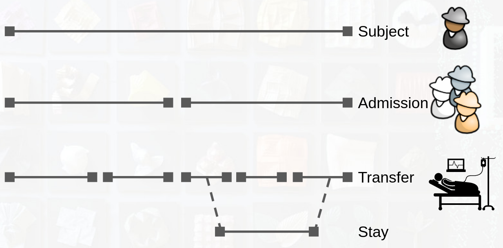

# MIMIC - Medical Information Mart for Intensive Care

Main page: https://mimic.mit.edu/

[MIMIC Database] from [1]

## Modeling a Patient in the Hospital

[Core Concepts](https://mimic.mit.edu/docs/iv/about/concepts/)

## MIMIC Documentation

[MIMIC IV](https://mimic.mit.edu/docs/iv/)

### Database Demo

[Database Demo](https://physionet.org/content/mimiciii-demo/1.4/)

## Getting Started

[Getting Started](https://mimic.mit.edu/docs/gettingstarted/)

[1]: Johnson, A. E. W., Pollard, T. J., Shen, L., Lehman, L. W. H., Feng, M., Ghassemi, M., Moody, B., Szolovits, P., Anthony Celi, L., & Mark, R. G. (2016). MIMIC-III, a freely accessible critical care database. Scientific Data 2016 3:1, 3(1), 1–9. https://doi.org/10.1038/sdata.2016.35
