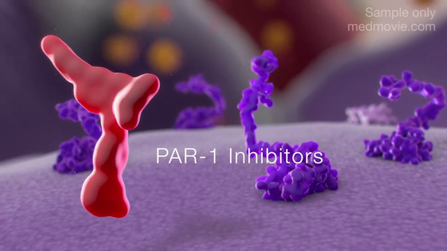

# Biological Scales

## Cells in the World

### Voyage into the world of atoms

<iframe width="560" height="315" src="https://www.youtube.com/embed/7WhRJV_bAiE?si=RPkd-9HIKboFVJMn" title="YouTube video player" frameborder="0" allow="accelerometer; autoplay; clipboard-write; encrypted-media; gyroscope; picture-in-picture; web-share" referrerpolicy="strict-origin-when-cross-origin" allowfullscreen></iframe>

### How BIG are the CELLS?

<iframe width="560" height="315" src="https://www.youtube.com/embed/uIGOOcrT86A?si=tVXePBFj4eHU9mkx" title="YouTube video player" frameborder="0" allow="accelerometer; autoplay; clipboard-write; encrypted-media; gyroscope; picture-in-picture; web-share" referrerpolicy="strict-origin-when-cross-origin" allowfullscreen></iframe>

### Our Viral World

## Communication among Cells

### Megli

* [About](https://patentes.inova.unicamp.br/tecnologia/pc269_megli/)
* [Android](https://play.google.com/store/apps/details?id=com.gogo.meglitest&hl=pt)

## Inside Cells

### From DNA to Protein

<iframe width="560" height="315" src="https://www.youtube.com/embed/gG7uCskUOrA?si=mXxkFFmMV1gmD_yt" title="YouTube video player" frameborder="0" allow="accelerometer; autoplay; clipboard-write; encrypted-media; gyroscope; picture-in-picture; web-share" referrerpolicy="strict-origin-when-cross-origin" allowfullscreen></iframe>

## Proteins

### Molecular Structure Animation

<iframe width="560" height="315" src="https://www.youtube.com/embed/Ms_ehUVvKKk?si=P3V37hlQc97O6hSJ" title="YouTube video player" frameborder="0" allow="accelerometer; autoplay; clipboard-write; encrypted-media; gyroscope; picture-in-picture; web-share" referrerpolicy="strict-origin-when-cross-origin" allowfullscreen></iframe>

### Protease-Activated Receptor 1 Inhibitors (PAR-1) - reducing occlusive thrombus formation

## Pathways

### Apoptotic Pathways

<iframe width="560" height="315" src="https://www.youtube.com/embed/SyvOPXeg4ig?si=zm1vEMkX3VoLhIRZ" title="YouTube video player" frameborder="0" allow="accelerometer; autoplay; clipboard-write; encrypted-media; gyroscope; picture-in-picture; web-share" referrerpolicy="strict-origin-when-cross-origin" allowfullscreen></iframe>

## More References

## Cells in the World

### Cell Size and Scale

### Powers of Ten

<iframe width="560" height="315" src="https://www.youtube.com/embed/0fKBhvDjuy0?si=nhwGXbDLXKGn66oi" title="YouTube video player" frameborder="0" allow="accelerometer; autoplay; clipboard-write; encrypted-media; gyroscope; picture-in-picture; web-share" referrerpolicy="strict-origin-when-cross-origin" allowfullscreen></iframe>

### explOratorium - COVID 19

https://www.exploratorium.edu/learn#covid-19

## Inside Cells

### What is a Protein?

<iframe width="560" height="315" src="https://www.youtube.com/embed/wvTv8TqWC48?si=l3VOQzJa3M-9zEBz" title="YouTube video player" frameborder="0" allow="accelerometer; autoplay; clipboard-write; encrypted-media; gyroscope; picture-in-picture; web-share" referrerpolicy="strict-origin-when-cross-origin" allowfullscreen></iframe>

### yg - your genome

* https://www.yourgenome.org/
* https://www.youtube.com/yourgenome

<iframe width="560" height="315" src="https://www.youtube.com/embed/v10bUR2aL5g?si=_gFmFPaSBx3GOMPE" title="YouTube video player" frameborder="0" allow="accelerometer; autoplay; clipboard-write; encrypted-media; gyroscope; picture-in-picture; web-share" referrerpolicy="strict-origin-when-cross-origin" allowfullscreen></iframe>

## Proteins

### Coagulation Cascade Explained

<iframe width="560" height="315" src="https://www.youtube.com/embed/DKFSH5MMPLM?si=VVuvkRZc1H3egX-D" title="YouTube video player" frameborder="0" allow="accelerometer; autoplay; clipboard-write; encrypted-media; gyroscope; picture-in-picture; web-share" referrerpolicy="strict-origin-when-cross-origin" allowfullscreen></iframe>

## Molecules

### Molecular animation

<iframe width="560" height="315" src="https://www.youtube.com/embed/-DYtddNSugo?si=6EaMj3o94Y_9abPk" title="YouTube video player" frameborder="0" allow="accelerometer; autoplay; clipboard-write; encrypted-media; gyroscope; picture-in-picture; web-share" referrerpolicy="strict-origin-when-cross-origin" allowfullscreen></iframe>